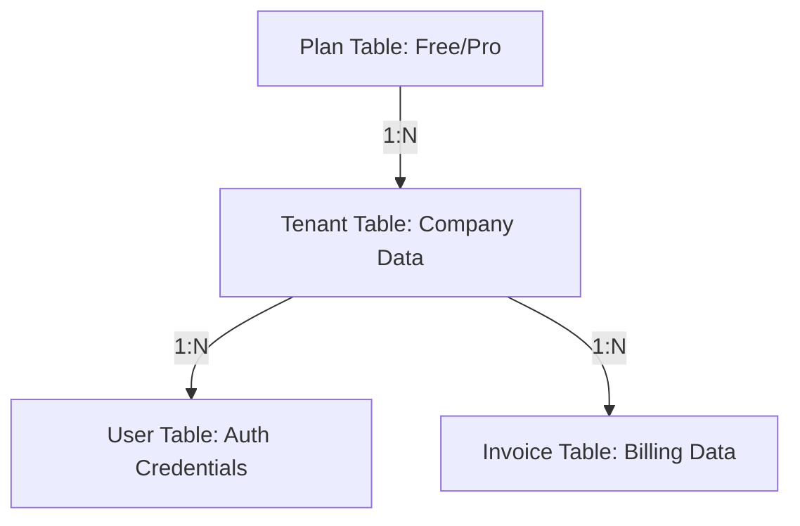
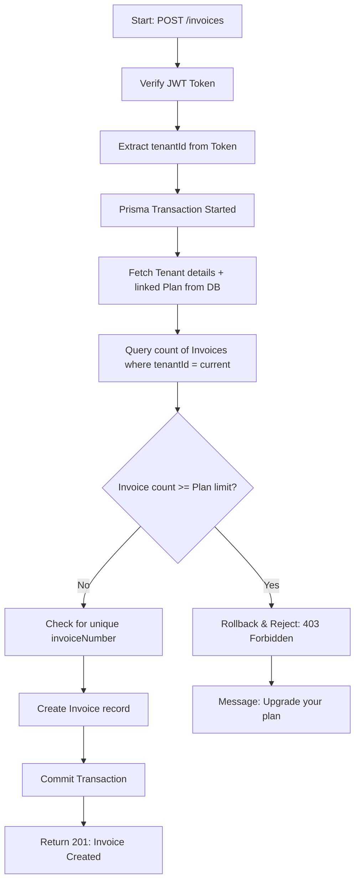

# Backend Algorithm & Workflow Documentation

This document describes the core logical algorithms used in the Invoice-BackEndProject.

## 1. Multi-Tenant Architecture Overview

The system uses a relational model to isolate data between different companies (Tenants).

---

## 2. Authentication Algorithm

### Signup Algorithm
1. Receive `name`, `email`, `password`, and `companyName`.
2. Check if the `email` already exists in the `User` table.
3. If exists: Return `400 Bad Request`.
4. Hash the `password` using Bcrypt.
5. **Atomic Transaction**:
    - Create a new `Tenant` record.
    - Look up the "FREE" record in the `Plan` table and associate it with the Tenant.
    - Create a new `User` record linked to the `Tenant`.
6. Return `201 Created`.

### Login Algorithm
1. Receive `email` and `password`.
2. Find the `User` record by `email`.
3. If not found: Return `401 Unauthorized`.
4. Compare the provided `password` with the hashed `password` in the database.
5. If mismatch: Return `401 Unauthorized`.
6. Sign a **JWT Token** containing:
    - `userId`
    - `tenantId`
7. Return the Token.

---

## 3. Invoice Generation Algorithm (Core Logic)

This is the most critical logic that enforces subscription limits.

### Logical Steps:
1. **Request Validation**: Verify the user is authenticated via JWT.
2. **Context Enrichment**: Fetch the full Tenant object, including its current Plan (to see the `maxInvoices` limit).
3. **Atomic Capacity Check**:
   - Operations are wrapped in a **Prisma Transaction**.
   - Current Plan details are fetched fresh from the database to ensure accuracy.
   - If User is on **FREE**: Limit = 10.
   - If User is on **PRO**: Limit = 100.
4. **Data Integrity**: Checks for duplicate `invoiceNumber` per tenant (enforced by `@@unique` constraint in schema).
5. **Enforcement**: If `currentInvoices >= Limit`, block the creation and return the "upgrade to PRO" message.
6. **Finalization**: If within limits, generate the invoice and associate it with the `tenantId`.

---

## 4. Invoice Retrieval Algorithm (Scalability)

To ensure performance for large accounts, `GET /invoices` implements pagination.

1. Receive `page` and `limit` query parameters (defaults: page=1, limit=10).
2. Calculate `skip = (page - 1) * limit`.
3. Perform two concurrent database operations:
    - Fetch invoices with `skip` and `take: limit`.
    - Count total invoices for the tenant.
4. Return data wrapped in a response object containing metadata (total items, total pages, current page).

---

## 5. Plan Upgrade Algorithm (Secured)

1. Receive an upgrade request from an authenticated user.
2. Fetch current Tenant details to verify if already on "PRO".
3. If already PRO: Return `400 Bad Request`.
4. **Security Check**: (Placeholder) In production, verify payment via external provider (Stripe, etc.).
5. Find the "PRO" record ID in the `Plan` table.
6. Update the `Tenant` record setting `planId` = `PRO_ID`.
7. Return Success message.

---

> [!TIP]
> **Data Integrity**: All cross-table operations are performed within **Prisma Transactions** to ensure that if any step fails (e.g., user creation failure), the entire operation (e.g., tenant creation) is rolled back.
